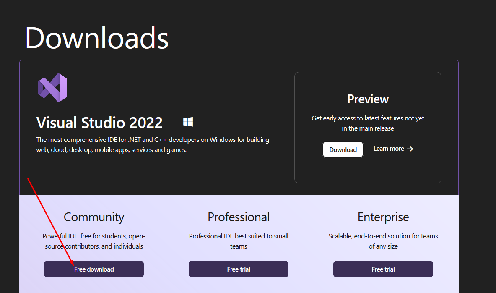
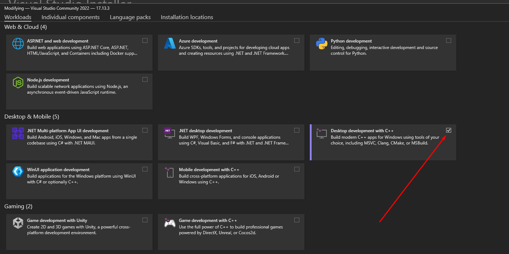
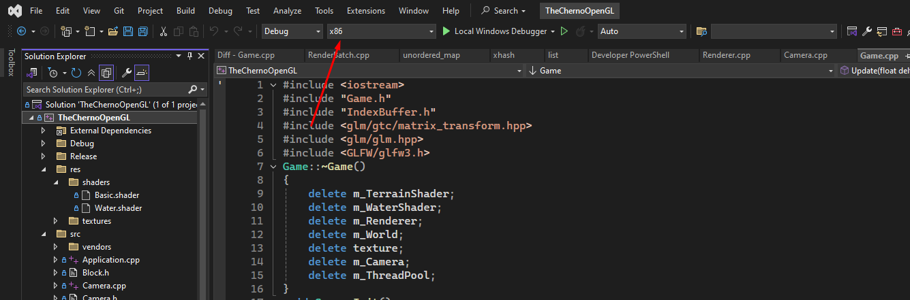

# How to run

Download and install visual studio 2022 community https://visualstudio.microsoft.com/downloads/

And when the installer starts pick "Desktop development with C++"
Open "TheChernoOpenGL.sln" from the project
Change the configuration from x64 to x86 if it is not set

Press F5 to run
